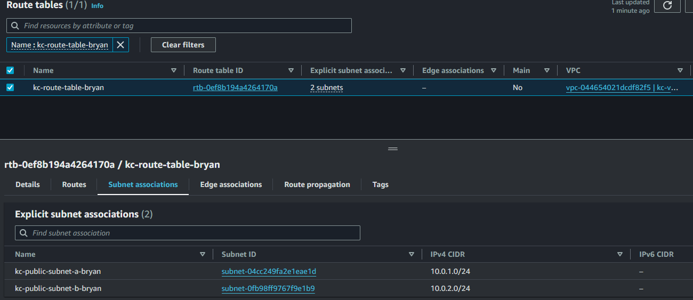

# Práctica Final de AWS - Bootcamp Keepcoding AWS
## Requisitos
Hacer una plantilla de Terraform que despliegüe:
- un **nginx** en un **Cluster ECS**. 
- Generar un output de Terraform con el endpoint de conexión.

### Parámetros de Entrega:

- Se entrega al final del módulo de AWS.
- Se debe entregar la plantilla Terraform para ser ejecutada por el Intructor a fín de evaluar la práctica final.
- La entrega es a través del GitHub del alumno.
- Al finalizar el tiempo de entrega, se facilitará la solución de la práctica final.

**Tips:** Se debe crear antes el **Task Definition** y para facilitar la práctica se hace en la **VPC Defaulft Pública**.  

## Despliegue de la plantilla.
Para realizar el despliegue de la plantilla se ha hecho de manera modular, tambien se ha ido desarrollando paso a paso para verificar el funcionamiento de las partes por separado.  
El esquema general del despliegue es el siguiente:  
```
AWS_PRACTICA/
│
├── modules/               # Directorio que contiene módulos reutilizables.
│   ├── alb/               # Módulo para configurar el Application Load Balancer (ALB).
│   ├── autoscaling/       # Módulo para configurar el Auto Scaling Group (ASG).
│   ├── ecs_cluster/       # Módulo para configurar el clúster ECS.
│   ├── iam/               # Módulo para manejar los roles IAM.
│   ├── security_group/    # Módulo para gestionar los grupos de seguridad.
│   └── vpc/               # Módulo para la configuración de la VPC.
│
├── .gitignore             # Archivo para excluir ciertos archivos del control de versiones.
├── data.tf                # Definiciones de datos (como AMIs, VPCs existentes, etc.).
├── main.tf                # Archivo principal donde se invocan los módulos y recursos.
├── outputs.tf             # Archivo de salidas que exporta valores clave (ARNs, IDs, etc.).
├── README.md              # Documentación del despliegue.
└── variables.tf           # Definiciones de variables globales para el despliegue.

```  
Cada modulo tiene su configuración que se hará estandar para todos los modulos:  
```
modules/
│
└── alb/                   # Módulo para configurar el Application Load Balancer (ALB).
    ├── main.tf            # Archivo principal que define los recursos del ALB.
    ├── outputs.tf         # Archivo que exporta los valores clave del ALB (ARN, DNS, etc.).
    └── variables.tf       # Archivo donde se definen las variables utilizadas en este módulo.
```

### VPC
Se crea los diferentes componentes en la ruta: `./modules/vpc` y se hace la llamada desde el `main.tf` principal.  
Se crean una nueva VPC y dos subnets públicas:  
```
# Crea la primera subnet pública dentro de la VPC
resource "aws_subnet" "public_subnet_a" {
  vpc_id                  = aws_vpc.main.id
  cidr_block              = var.public_subnet_a_cidr # Bloque CIDR específico de la subnet
  map_public_ip_on_launch = true # Asigna una IP pública automáticamente al lanzar instancias
  availability_zone       = var.availability_zone_a # Zona de disponibilidad donde se creará la subnet

  # Identificar la subnet a
  tags = {
    Name = var.public_subnet_a_name
  }
}

# Crea la segunda subnet pública dentro de la VPC
resource "aws_subnet" "public_subnet_b" {
  vpc_id                  = aws_vpc.main.id
  cidr_block              = var.public_subnet_b_cidr
  map_public_ip_on_launch = true 
  availability_zone       = var.availability_zone_b 

  # Identificar la subnet b
  tags = {
    Name = var.public_subnet_b_name
  }
}
```  
#### Internet Gateway
Permitirá el tráfico de entrada y salida de la VPC hacia internet.  
```
resource "aws_internet_gateway" "gw" {
  vpc_id = aws_vpc.main.id

  # Etiqueta para identificar el gateway
  tags = {
    Name = var.gateway_name
  }
}
```  
#### Route table
```
resource "aws_route_table" "public_rt" {
  vpc_id = aws_vpc.main.id

  # Define una ruta que envía todo el tráfico (0.0.0.0/0) hacia el Internet Gateway
  route {
    cidr_block = "0.0.0.0/0"
    gateway_id = aws_internet_gateway.gw.id
  }

  # Etiqueta para identificar la tabla de rutas
  tags = {
    Name = var.route_table_name
  }
}
```  
Y finalmente hay que asociar la subnet a la tabla de rutas  
```
resource "aws_route_table_association" "public_a" {
  subnet_id      = aws_subnet.public_subnet_a.id
  route_table_id = aws_route_table.public_rt.id
}
```
Esto debe ser para las dos subnets, para la segunda es similar.

Una vez se ha creado este modulo, se puede comprobar que funciona. Para ello ejecutaremos el siguiente comando `terraform apply` y comprobamos que se ha creado correctamente:  
  

### ECS Cluster (Elastic Container Service)
El siguiente paso es crear un cluster ECS, para ello se crea el componente en la ruta: `./modules/ecs_cluster` y se hace la llamada desde el `main.tf` principal.  
```
resource "aws_ecs_cluster" "main" {
  name = var.cluster_name
} 
``` 
El código anterior creará un clúster vacío, pero para que el clúster ejecute contenedores, necesita instancias EC2 en las que ejecutará estos contenedores.  

Tambien necesitamos definir una plantilla de lanzamiento y un grupo de autoescalado, esto es necesario debido a que las instancias EC2 se crearán y escalarán automáticamente.  

Para implementar esto, necesitamos crear estos recursos: 

- IAM Role para los nodos ECS
- Security Group (SG) para los nodos ECS
- Launch Template (describe la instancia EC2)
- Autoscaling Group (AG)
- Capacity Provider para conectar el ECS Cluster y Autoscaling Group  

#### IAM role y Security group (SG)
Empezamos creando el rol de IAM para el nodo ECS. Esta plantilla se crea en la ruta: `./modules/iam`.    
```
# IAM Role para las instacias EC2
resource "aws_iam_role" "ecs_instance_role" {
  
  name = "kc-ecs-instance-role-bryan"

  assume_role_policy = <<-EOF
    {
      "Version": "2012-10-17",
      "Statement": [
        {
          "Action": "sts:AssumeRole",
          "Principal": {
            "Service": "ec2.amazonaws.com"
          },
          "Effect": "Allow",
          "Sid": ""
        }
      ]
    }
  EOF
}

# Adjuntar política para ECS a la instancia EC2
resource "aws_iam_role_policy_attachment" "ecs_instance_policy" {
  role       = aws_iam_role.ecs_instance_role.name
  policy_arn = "arn:aws:iam::aws:policy/service-role/AmazonEC2ContainerServiceforEC2Role"
}

# Instance Profile para EC2
resource "aws_iam_instance_profile" "ecs_instance_profile" {
  name = "kc-ecs-instance-profile-bryan"
  role = aws_iam_role.ecs_instance_role.name
}
```  
Ahora se crea el grupo de seguridad (SG) para permitir el tráfico de salida. Esta plantilla se crea en la ruta: `./modules/security_group`.    
```
resource "aws_security_group" "ecs_sg" {
  vpc_id = var.vpc_id # Usar la variable vpc_id pasada desde el main.tf

  ingress {
    from_port   = 80
    to_port     = 80
    protocol    = "tcp"
    cidr_blocks = ["0.0.0.0/0"]  # Permitir tráfico HTTP desde cualquier IP
  }

  egress {
    from_port   = 0
    to_port     = 0
    protocol    = "-1"  # Todo tráfico de salida permitido
    cidr_blocks = ["0.0.0.0/0"]
  }

  ingress {
    from_port   = 22
    to_port     = 22
    protocol    = "tcp"
    cidr_blocks = ["79.117.8.215/32"]  # Reemplaza con tu IP local, o usa "0.0.0.0/0" para permitir desde cualquier IP
  }

  tags = {
    Name = "ecs-security-group"
  }
}
``` 
Como se va a usar un servicio nginx, en el `ingress` habilitamos el tráfico en el puerto 80 y para realizar algunas comprobaciones se habilita el acceso SSH (puerto 22).  
#### Launch Template
El siguiente paso es crear `Launch Template` para las instancias EC2. Esta plantilla se crea en la ruta: `./modules/autoscaling`.    
```
# Launch Template para las instancias EC2
resource "aws_launch_template" "ecs_launch_template" {
  name_prefix   = "kc-ecs-launch-template-pf-bryan"
  image_id        = data.aws_ssm_parameter.ecs_node_ami.value #var.ami_id
  instance_type   = var.instance_type

  # Acceso ssh
  key_name = "kc-kp-bryan"
    
  #iam_instance_profile = var.instance_profile_name
  iam_instance_profile {
    name = var.instance_profile_name
  }

  #security_groups = [var.security_group_id]
  network_interfaces {
    security_groups = [var.security_group_id]
    associate_public_ip_address = true
  }

  user_data = base64encode(<<-EOF
              #!/bin/bash
              echo ECS_CLUSTER=${var.ecs_cluster_name} >> /etc/ecs/ecs.config
            EOF
          )
}
```
Algunas consideraciones para esta implementación son:  
- `user_data`: Se le debe pasar el nombre del clúster ECS, para que AWS pueda registrar la instancia EC2 como nodo del clúster ECS.  
- `key_name`: se le debe pasar el nombre de la llave para el acceso SSH. Al ser para pruebas no se genera automáticamente, sino que se usa una ya existente.  

#### Autoscaling Group (AG)  
Ahora se debe crear el `AG` y conectarlo con el `Launch templete` creado anteriormente. Esta plantilla se crea en la ruta: `./modules/autoscaling`.  
```
# Auto Scaling Group que usa el Launch Template
resource "aws_autoscaling_group" "ecs_asg" {
  name_prefix = "kc-ag-pf-bryan"
  #launch_configuration = aws_launch_configuration.ecs_launch_config.id
  min_size             = var.min_size
  max_size             = var.max_size
  desired_capacity     = var.desired_capacity
  vpc_zone_identifier  = var.subnets

  launch_template {
    id      = aws_launch_template.ecs_launch_template.id
    version = "$Latest"
  }

  tag {
    key                 = "Name"
    value               = var.ecs_instance_name
    propagate_at_launch = true
  }
}
```  
Algunas consideraciones para esta implementación son:
- `min_size`, `max_size` y `desired_capacity`: En estas variables se establece el número de instancias EC2 que se crearán usando el `Launch templete`. En este caso se crearán 2 instancias como mínimo y máximo 3.  
- `launch_template {...}`: Aqui se le debe referenciar al que creamos anteriormente y con el `version` se ke indica que debe ser la mas reciente disponible.  

En este punto ya se puede comprobar que las instancias se crean correctamente, por tanto, usamos el comando `terraform apply`.   
Para verificar la creación de las instancias, entramos en la consola de `AWS` y accedemos al apartado `EC2 > Instances`  
  

#### Capacity Provider
Finalmente, debemos conectar el clúster ECS al grupo de autoescalado para que el clúster pueda usar instancias EC2, para ello debemos implementar `Capacity provider`. Esta plantilla se crea en la ruta: `./modules/autoscaling`.
```
# Crear el capacity provider
resource "aws_ecs_capacity_provider" "ecs_capacity_provider" {
  name = "kc-ecs-capacity-provider-bryan"

  auto_scaling_group_provider {
    auto_scaling_group_arn         = aws_autoscaling_group.ecs_asg.arn
    managed_termination_protection = "DISABLED"

    managed_scaling {
      maximum_scaling_step_size = 2
      minimum_scaling_step_size = 1
      status                    = "ENABLED"
      target_capacity           = 100
    }
  }
}
```  
Y lo debemos asociar al cluster:  
```
# Asociar el Capacity Provider al ECS Cluster
resource "aws_ecs_cluster_capacity_providers" "ecs_cluster_capacity_providers" {
  cluster_name       = var.ecs_cluster_name
  capacity_providers = [aws_ecs_capacity_provider.ecs_capacity_provider.name]

  default_capacity_provider_strategy {
    capacity_provider = aws_ecs_capacity_provider.ecs_capacity_provider.name
    weight            = 1
  }
}
```
Verificamos que se ha implementado correctamente, ejecutamos `terraform apply`, y en la consola accedemos a `Amazon Elastic Container Service > Clusters`, en el apartado `Infrastructure` deberiamos ver las instancias `EC2` creadas.   
  

### Crear ECS Service
En este apartado se creará y se configurará el servicio en el `ECS`. Para ello, se seguirá el siguiente plan:

- Crear un rol IAM para `ECS Task`
- Crear una `Task Definition`
- Crear un `ECS Service`
- Crear un `Load Balancer (ALB)`
- Conectar el `ECS Service` to `ALB`

#### rol IAM para ECS Task
Se deberá crear el IAM Role y adjuntar las políticas necesarias para que sea utilizado por la Task Definition. Esta definición se creará en `./modules/iam`.  
```
# Crear un IAM role especifico para el autoescalado
# IAM Role para ECS Task Execution
resource "aws_iam_role" "ecs_task_execution_role" {
  name = "ecs_task_execution_role"

  assume_role_policy = jsonencode({
    Version = "2012-10-17"
    Statement = [{
      Action = "sts:AssumeRole"
      Effect = "Allow"
      Principal = {
        Service = "ecs-tasks.amazonaws.com"
      }
    }]
  })
}

# Adjuntar política para ECS Task Execution
resource "aws_iam_role_policy_attachment" "ecs_task_execution_role_policy" {
  role       = aws_iam_role.ecs_task_execution_role.name
  policy_arn = "arn:aws:iam::aws:policy/service-role/AmazonECSTaskExecutionRolePolicy"
}
```  
#### Task definition
En la `Task definition` describimos de donde y como lanzar el contenedor docker con la imagen que necesitamos, en este caso `NGINX`. Esta definición se creará en `./modules/autoscalling`.  
```
# Task Definition para NGINX
resource "aws_ecs_task_definition" "nginx_task" {
  family                   = "nginx-task"
  network_mode             = "bridge" # Cambia a bridge para compatibilidad con target_type instance
  requires_compatibilities = ["EC2"]
  execution_role_arn       = var.ecs_task_execution_role_arn
  container_definitions = jsonencode([{
    name      = "nginx"
    image     = "nginx:latest"
    essential = true
    portMappings = [{
      containerPort = 80
      hostPort      = 80
    }]
    memory   = 512
    cpu      = 256
  }])
}
```  
*Nota*: La definición de la tarea se crea por cuenta de AWS, no por clúster de ECS. Por lo tanto, el nombre de la familia debe ser único.
#### ECS Service
Se creará un servicio para que esté disponible dentro del clúster y tener acceso a Internet. Esta definición se creará en `./modules/autoscalling`.  
```
# servicio ECS orquestará el despliegue de NGINX en las instancias EC2
resource "aws_ecs_service" "nginx_service" {
  name            = "nginx-service"
  cluster         = var.ecs_cluster_name
  task_definition = aws_ecs_task_definition.nginx_task.arn
  desired_count   = 1
  launch_type     = "EC2"

/* #Solo sirve si la configuracion de red en awsvpc
  network_configuration {
    subnets         = var.subnets
    security_groups = [var.security_group_id]
    assign_public_ip = true
  }
*/
}
```
Algunas consideraciones para esta implementación son:  
- `network_configuration`: Esta configuaración de debe implementar si la configuración de red para `awsvpc`. El modo de red awsvpc es generalmente utilizado para tareas que se ejecutan en AWS Fargate o en instancias EC2 con ENI asignados directamente.
En este caso, en el `Target group` al trabajar con instancias ECS sin ENI asignado, se usará tipo `instance`.  

Si ejecutamos `terraform apply` en este paso, creará y ejecutará un nuevo servicio. Lo podemos verificar en `Amazon Elastic Container Service > Clusters`, en el apartado `Services` 

  

#### Load Balancer (ALB)
Se creará el balanceador de carga, en el que debemos referencial el `SG` implementado previamente. Esta definición se creará en `./modules/alb`.  
```
# Recurso para crear un Application Load Balancer (ALB) en AWS.
# Este balanceador de carga se utilizará para distribuir el tráfico HTTP a las instancias ECS.
resource "aws_lb" "ecs_alb" {
  name               = var.alb_name
  internal           = false
  load_balancer_type = "application"
  security_groups    = [var.security_group_id]
  subnets            = var.subnets
  # Etiquetas para el ALB, para identificación en AWS.
  tags = {
    Name = var.alb_name
  }
}

# Recurso para crear un Target Group que será utilizado por el ALB.
# Este grupo define el puerto y protocolo de las instancias a las que se enruta el tráfico.
resource "aws_lb_target_group" "ecs_tg" {
  name     = var.target_group_name
  port     = 80
  protocol = "HTTP"
  vpc_id   = var.vpc_id

  # Verifica que las instancias estén saludables.
  health_check {
    path = "/"
    port = "80"
  }
}

# Recurso para crear un Listener para el ALB.
# Este listener escucha el tráfico en el puerto 80 (HTTP) y lo redirige al Target Group.
resource "aws_lb_listener" "ecs_listener" {
  load_balancer_arn = aws_lb.ecs_alb.arn
  port              = 80
  protocol          = "HTTP"

  # Redirige el tráfico al Target Group.
  default_action {
    type             = "forward"
    target_group_arn = aws_lb_target_group.ecs_tg.arn
  }
}
```  
#### Conectar el `ECS Service` al `ALB`
Para conectar el servico al baleanceadir de carga, se deberá actualizar la configuración de `aws_ecs_service` agregando una sección con `load_balancer`. Esta actualización se hará en `./modules/autoscaling`.  
```
# servicio ECS orquestará el despliegue de NGINX en las instancias EC2
resource "aws_ecs_service" "nginx_service" {
  name            = "nginx-service"
  cluster         = var.ecs_cluster_name
  task_definition = aws_ecs_task_definition.nginx_task.arn
  desired_count   = 1
  launch_type     = "EC2"
/* #Solo sirve si la configuracion de red en awsvpc
  network_configuration {
    subnets         = var.subnets
    security_groups = [var.security_group_id]
    assign_public_ip = true
  }
*/
  load_balancer {
    target_group_arn = var.target_group_arn
    container_name   = "nginx"
    container_port   = 80
  }

  depends_on = [
    var.lb_listener_arn  # Usar la variable lb_listener_arn
  ]
}
```  
Finalmente comprobamos que todos los servicios se ejecuten correctamente. Para ello se deberá ejecutar `terraform apply` y lo verificamos en `EC2 > Load Balancers`, en el apartado `Details`  

  

Accedemos al DNS del baleanceador y confirmamos que se puede acceder al servicio de `NGINX`:
  

#### Sacar datos por pantalla
En la practica se requiere generar un output con el endpoint de conexión, para ello debemos:  
- Añadir una nueva instancia en `./modules/lb/outputs.tf`:  
  ```
  # Devuelve el DNS Name del Application Load Balancer (ALB)
  output "alb_dns" {
  description = "DNS Name of the Application Load Balancer"
  value       = aws_lb.ecs_alb.dns_name
  }
  ```  
- Añadir una nueva instancia en el output principal en `./outputs.tf`:  
  ```
  # Devuelve el DNS Name del Application Load Balancer (ALB)
  output "alb_dns" {
    description = "DNS Name of the Application Load Balancer"
    value       = module.alb.alb_dns #aws_lb.ecs_alb.dns_name
  }
  ```     
- Obtenemos el siguiente resultado:
  

En la imagen podemos observar la variable `alb_dns` que nos mostrará el servico `NGINX` en el navegador web
## Mejoras futuras
Las posibles mejorar para el proyecto son:
- Obtimizar el código: Se podría modulizar aún mas le código, añadiendo nuevas plantillas como: `data.ft`, `provaider.ft`, etc. Estas plantilla se podrá implementar en todos los módulos.
- Añadir nuevas plantillas para una implementación rápida y hacer cambios sin afectar a producción. Se podría hacer una plantilla para `test` y otra para `producción` por ejemplo.
- Es posible agregar un nombre de dominio, certificado SSL, terminación HTTPS y enrutar tráfico entre diferentes servicios ECS.

## Referencias
Para el desarrollo del proyecto se usó como referencia los siguientes artículos y manuales:
- [AWS ECS Cluster on EC2 with Terraform](https://medium.com/@vladkens/aws-ecs-cluster-on-ec2-with-terraform-2023-fdb9f6b7db07)
- [How to Deploy an AWS ECS Cluster with Terraform](https://spacelift.io/blog/terraform-ecs)
- [AWS Terraform Manual](https://registry.terraform.io/providers/hashicorp/aws/latest/docs)